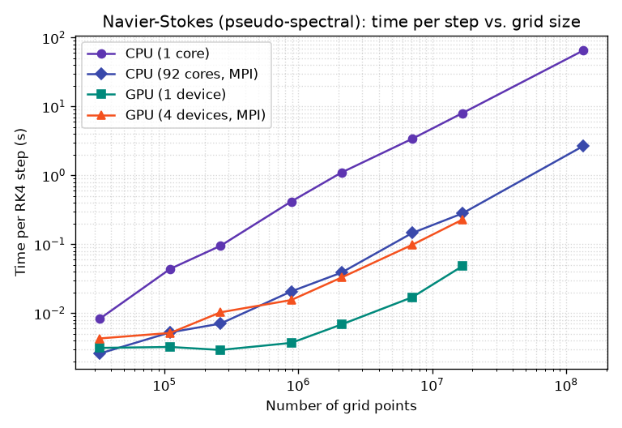
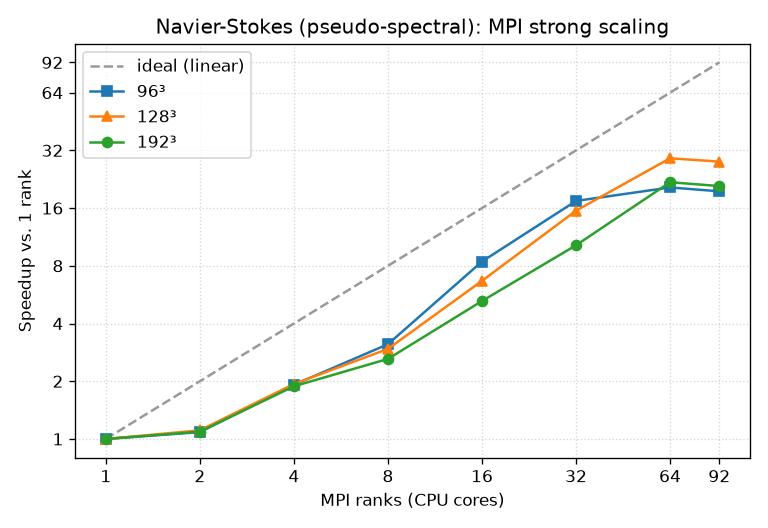

# Benchmark

Wall time of a single classical fourth-order Runge-Kutta step of the
pseudo-spectral [Navier-Stokes solver](implementation.md) (`benchmarks/bench_workload.py`,
Taylor-Green initial condition), across log-spaced **3D** grid sizes. Lower is
better.

!!! info "Test machine & code version"
    - **CPU:** AMD Instinct MI300A Accelerator (192 logical cores)
    - **GPU:** 4x AMD Instinct MI300A
    - **muNavierStokes:** `dcc04b3` — run 2026-06-24T15:13:45

Run configuration: triply-periodic box, kinematic viscosity `ν = 1/1600`,
time step `1e-3`, 2/3-rule dealiasing on. Each data point times 20 RK4 steps
(after warm-up) and reports the mean — i.e. a **fixed work budget**, so every
configuration performs identical arithmetic. Timing covers only the integration
loop (no file I/O, no diagnostics). One RK4 step evaluates the right-hand side
four times; each evaluation runs several 3-component forward/inverse FFTs plus the
fused per-pixel curl, dealiasing, viscous, and Leray-projection kernels.

## Time vs. grid size

The plot below merges the ways of running the *same* solver on this machine:

- **CPU (1 core)** — a single core, MPI disabled (the non-MPI muGrid build).
  muGrid's compute kernels carry no OpenMP, so a non-MPI CPU run uses one core.
- **CPU (92 cores, MPI)** — the whole CPU via MPI pencil decomposition
  (`mpiexec -n 92`), the grid split into per-rank subdomains whose FFTs
  exchange data each transform.
- **GPU (1 device)** — the whole GPU (cuFFT plus the fused device kernels).
- **GPU (N devices, MPI)** — all GPUs, one rank per device.

| Configuration | 32³ (33k) | 48³ (111k) | 64³ (262k) | 96³ (885k) | 128³ (2.1M) | 192³ (7.1M) | 256³ (16.8M) | 512³ (134.2M) |
|---|---|---|---|---|---|---|---|---|
| CPU (1 core) | 8.27 | 44 | 95 | 418 | 1.1e+03 | 3.39e+03 | 8.01e+03 | 6.5e+04 |
| CPU (92 cores, MPI) | 2.59 | 5.27 | 7.05 | 20.7 | 38.7 | 146 | 280 | 2.67e+03 |
| GPU (1 device) | 3.13 | 3.23 | 2.92 | 3.7 | 6.84 | 17 | 48 | — |
| GPU (4 devices, MPI) | 4.29 | 5.16 | 10.3 | 15.5 | 32.9 | 98 | 227 | — |

(values are **milliseconds per RK4 step**)



The workload is dominated by the multidimensional FFTs, which are
memory-bandwidth-bound, so the time tracks memory throughput rather than peak
FLOPs. Two regimes are visible. At **small grids** the GPU is overhead-bound: a
fixed per-step cost of kernel launches and host/device synchronisation (a few
milliseconds) dominates, so the GPU is actually the *slowest* configuration while
the single CPU core, with almost no fixed overhead, wins on the tiniest grids.
Past the crossover (here around \(10^5\) grid points) the picture flips: the
GPU's high memory bandwidth takes over and it becomes the fastest by a growing
margin, while the full CPU via MPI sits in between — well ahead of one core but
short of the GPU.

!!! note "Multi-GPU"
    The solver binds each MPI rank to the communicator it is given, so on a host
    with several GPUs `mpiexec -n <#GPUs> python bench_workload.py -d cuda` runs
    one rank per device. This benchmark adds a *GPU (N devices, MPI)* curve
    automatically when more than one GPU is present. **This run used several GPUs, so the multi-GPU curve is shown.**

## MPI strong scaling (CPU)

Strong scaling of the same step (fixed problem size, increasing MPI ranks) on the
92-core CPU.

**96³ (884,736 points)**

| Ranks | ms/step | Speedup | Parallel eff. |
|---|---|---|---|
| 1 | 413.53 | 1.00× | 100% |
| 2 | 380.82 | 1.09× | 54% |
| 4 | 215.73 | 1.92× | 48% |
| 8 | 132.52 | 3.12× | 39% |
| 16 | 49.10 | 8.42× | 53% |
| 32 | 23.71 | 17.44× | 54% |
| 64 | 20.17 | 20.50× | 32% |
| 92 | 21.13 | 19.57× | 21% |

**128³ (2,097,152 points)**

| Ranks | ms/step | Speedup | Parallel eff. |
|---|---|---|---|
| 1 | 1103.72 | 1.00× | 100% |
| 2 | 994.89 | 1.11× | 55% |
| 4 | 570.58 | 1.93× | 48% |
| 8 | 374.19 | 2.95× | 37% |
| 16 | 165.27 | 6.68× | 42% |
| 32 | 71.17 | 15.51× | 48% |
| 64 | 37.93 | 29.10× | 45% |
| 92 | 39.49 | 27.95× | 30% |

**192³ (7,077,888 points)**

| Ranks | ms/step | Speedup | Parallel eff. |
|---|---|---|---|
| 1 | 3407.55 | 1.00× | 100% |
| 2 | 3120.94 | 1.09× | 55% |
| 4 | 1809.77 | 1.88× | 47% |
| 8 | 1302.92 | 2.62× | 33% |
| 16 | 650.18 | 5.24× | 33% |
| 32 | 332.79 | 10.24× | 32% |
| 64 | 156.09 | 21.83× | 34% |
| 92 | 163.47 | 20.84× | 23% |



Scaling is strong at low rank counts and then tapers: the pseudo-spectral step is
memory-bandwidth-bound and the distributed FFT needs an all-to-all transpose each
transform, so once per-rank subdomains get small the transpose communication and
the CG-style reductions begin to dominate. Larger grids keep scaling further
because they keep more work per rank.

All data points live in the shared benchmark database `benchmarks/results.csv`
(date, code version, machine, parameters, results). This page is generated by
`benchmarks/benchmark.py`; re-render it from the database (no recompute) with
`--render-only`, or run a fresh measurement that appends a new dated row set:

```bash
python benchmarks/benchmark.py --doc-out docs/benchmark.md
```
